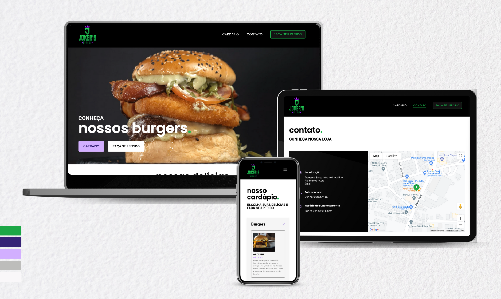

# Joker's Burger - Hamburger Shop

Welcome to the Joker's Burger project, a Brazilian hamburger shop web application built with JS, HTML, CSS, and React (Vite).
The project includes a menu page with an accordion list, a contact page, and a home page. The Google Maps API is integrated to display the shop's location.
The project utilizes PropTypes to define and enforce the expected data types of props passed to certain React components. PropTypes is a helpful tool for catching bugs related to data type mismatches during development.

## Project Structure

- **Components:**

  - `NavBar`: Navigation bar component.
  - `MapContainer`: Container for displaying the Google Maps.
  - `MenuCategory`: Component for displaying menu categories.
  - `MenuItemDetail`: Component to show details of a menu item.
  - `Footer`: Footer component.

- **Pages:**

  - `HomePage`: Landing page for the hamburger shop.
  - `ContactPage`: Page with contact information and the Google Maps API is integrated to display the shop's location.
  - `MenuPage`: Page displaying the menu with an accordion list.

- **Data:**

  - `dataJson`: JSON file containing all the data for the menu.

- **Styles:**
  - CSS styles for all components and pages.

## Responsive Design

Joker's Burger is designed with a responsive layout, ensuring a seamless and user-friendly experience across various devices. The project adapts to different screen sizes, providing accessibility and optimal viewing on both desktop and mobile platforms.

## Deployment

The project is deployed using Vercel. You can access the live application [here](https://jokers-burger.vercel.app/).

## Authors

The project was developed by [Fernanda Souza](https://www.linkedin.com/in/fernanda-souza-dev/) and [Louise Carnevali](https://www.linkedin.com/in/louisecarnevali/).

## Demo

